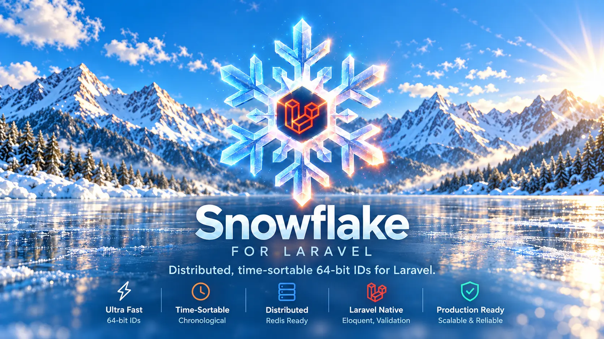

# Snowflake for Laravel

[](https://packagist.org/packages/mahmoudtr/snowflake-for-laravel)
[](https://github.com/Mahmoud217TR/snowflake-for-laravel/actions/workflows/run-tests.yml)
[](https://github.com/Mahmoud217TR/snowflake-for-laravel/actions/workflows/phpstan.yml)

Generate time-sortable Snowflake IDs, store them in `BIGINT` columns, and expose them as strings. Includes Redis-backed coordination, Eloquent IDs and casts, schema macros, validation, and Artisan commands.

```php
use MahmoudTR\Snowflake\Facades\Snowflake;

$id = Snowflake::generate(); // Always a decimal string.
$parts = Snowflake::inspect($id);

$parts->timestamp;   // CarbonImmutable, UTC.
$parts->generatorId; // int, 0–1023.
$parts->sequence;    // int, 0–4095.

Snowflake::isValid($id); // true
```

## Requirements

- PHP 8.4 or newer, on a **64-bit runtime**.
- Laravel: [Composer constraints](composer.json) allow 11, 12, and 13; Laravel 12 and 13 are covered by the [CI matrix](.github/workflows/run-tests.yml).
- For the default Redis driver: a Redis server and either PhpRedis or Predis.

## Installation

```bash
composer require mahmoudtr/snowflake-for-laravel
```

For the unreleased development branch, use `mahmoudtr/snowflake-for-laravel:dev-dev` instead. The package must be available through Packagist or a configured Composer VCS repository.

Laravel discovers the service provider automatically. Publish the configuration:

```bash
php artisan vendor:publish --tag="snowflake-for-laravel-config"
```

Set a generator ID in your application's `.env`:

```dotenv
SNOWFLAKE_GENERATOR_ID=0
SNOWFLAKE_STATE_DRIVER=redis
```

The generator ID is **required**, including when using local state. There is no automatic allocation or hostname-based fallback.

The Redis driver uses Laravel's Redis configuration in `config/database.php`. Install the PhpRedis extension, or use Predis:

```bash
composer require predis/predis
```

```dotenv
REDIS_CLIENT=predis
```

The package ships no application migrations or views to publish. Create your tables using the schema macros below.

## Configuration

See [`config/snowflake.php`](config/snowflake.php) for the complete configuration.

| Environment variable | Default | Purpose |
| --- | --- | --- |
| `SNOWFLAKE_EPOCH` | `1767225600000` | Non-negative Unix milliseconds; January 1, 2026, UTC. |
| `SNOWFLAKE_GENERATOR_ID` | None; required | Integer from `0` through `1023`. |
| `SNOWFLAKE_MAX_ROLLBACK_MS` | `5` | Maximum clock rollback to wait through; non-negative milliseconds. |
| `SNOWFLAKE_STATE_DRIVER` | `redis` | `redis` or `local`. |
| `SNOWFLAKE_REDIS_CONNECTION` | `default` | Named Laravel Redis connection. |
| `SNOWFLAKE_REDIS_PREFIX` | `snowflake:state` | State key namespace; each generator uses `{prefix}:{generatorId}`. |

Choose the epoch before generating IDs and **do not change it afterward**. All producers and readers in the same ID namespace must use the same epoch.

After changing cached configuration, rebuild it and restart long-running workers:

```bash
php artisan config:cache
```

### Redis state

Redis allocates sequences atomically. Multiple processes using the same generator ID coordinate correctly when they share the same Redis database and effective key prefix. Laravel's own Redis connection prefix is applied in addition to the Snowflake prefix.

Different generator IDs have independent state. Producers that do **not** share state must use different generator IDs within the same ID namespace.

Keep Redis state durable and protected from eviction or deletion. Losing state, changing prefixes, or restoring older state can permit duplicate IDs; the package does not recover lost allocation history. Redis failures propagate rather than silently falling back to local state.

### Local state

```dotenv
SNOWFLAKE_GENERATOR_ID=0
SNOWFLAKE_STATE_DRIVER=local
```

Local state lives only in the application's in-memory store. It is useful for tests and isolated tools, but does not coordinate separate requests, processes, or restarts. **Use Redis for shared application workloads**, particularly PHP-FPM and multi-worker deployments.

## Generate, inspect, and validate

The facade and helper expose the same API:

```php
use MahmoudTR\Snowflake\Facades\Snowflake;

$id = Snowflake::generate();
$parts = Snowflake::inspect($id);
$valid = Snowflake::isValid($id);

$id = snowflake()->generate();
$parts = snowflake()->inspect($id);
$valid = snowflake()->isValid($id);
```

`inspect()` accepts decimal strings and non-negative PHP integers. It returns `MahmoudTR\Snowflake\ValueObjects\SnowflakeParts`, containing the absolute UTC timestamp, generator ID, and sequence. Invalid input throws `MahmoudTR\Snowflake\Exceptions\InvalidSnowflake`.

`isValid()` accepts any input and returns a boolean. The accepted numeric range is **0 through 9223372036854775807**. Leading zeroes are accepted and decoded numerically; negatives, decimal notation, scientific notation, floats, arrays, and non-digit strings are rejected.

Validation checks the numeric representation and range. It does not prove that an ID was generated by this package, exists in your database, or belongs to the current user.

### Strings at application boundaries

Generated IDs are strings, and `HasSnowflakeIds` exposes model IDs as strings in arrays and JSON. JavaScript's `Number` cannot represent the full Snowflake range exactly: keep IDs as strings in APIs, browser code, and storage outside the database. Do not use `Number(id)` or PHP's `JSON_NUMERIC_CHECK` for IDs.

## Database migrations

```php
use Illuminate\Database\Schema\Blueprint;
use Illuminate\Support\Facades\Schema;

Schema::create('users', function (Blueprint $table) {
    $table->snowflake(); // Non-auto-incrementing unsigned BIGINT primary key named id.
    $table->string('name');
    $table->timestamps();
});

Schema::create('posts', function (Blueprint $table) {
    $table->snowflake();
    $table->foreignSnowflake('user_id')->constrained();
    $table->timestamps();
});
```

Use `snowflake()` **instead of** `$table->id()`. It already marks the column as primary; no extra `->primary()` call is needed. A custom name is supported:

```php
$table->snowflake('snowflake_id');
```

`foreignSnowflake()` returns Laravel's `ForeignIdColumnDefinition`, so `constrained()`, `nullable()`, and foreign-key actions work normally. Both macros use unsigned `BIGINT` definitions; PostgreSQL uses signed `BIGINT`, and SQLite maps them to its 64-bit `INTEGER` storage.

Use `foreignSnowflake()` rather than `foreignIdFor()` for these models: Laravel infers the latter's column type from the model's string key type, not its numeric database storage.

## Eloquent

```php
namespace App\Models;

use Illuminate\Database\Eloquent\Model;
use MahmoudTR\Snowflake\Concerns\HasSnowflakeIds;

class User extends Model
{
    use HasSnowflakeIds;

    protected $fillable = ['name'];
}
```

```php
$user = User::create(['name' => 'Ada']);

$user->getKey(); // Generated decimal string.
$user->toArray()['id']; // String, not a JSON number.
```

The trait generates missing primary keys, disables auto-incrementing, sets the exposed key type to string, and adds the `AsSnowflake` primary-key cast. You do not need to set `$incrementing`, `$keyType`, or an ID cast yourself.

Valid manually assigned IDs are preserved, including `0`. Invalid assignments throw `InvalidSnowflake`. Invalid route-binding IDs raise Laravel's `ModelNotFoundException` before querying, normally producing a 404 response; valid IDs still need to resolve to a record.

### Cast other Snowflake columns

```php
use MahmoudTR\Snowflake\Casts\AsSnowflake;

protected function casts(): array
{
    return [
        'user_id' => AsSnowflake::class,
    ];
}
```

The cast exposes non-null values as strings, preserves `null`, and validates assigned values before storage. A foreign-key macro alone does not add an Eloquent cast.

## Validation rules

Use the registered rule name:

```php
$request->validate([
    'id' => ['required', 'snowflake'],
]);
```

Or the rule object:

```php
use MahmoudTR\Snowflake\Rules\Snowflake;

$request->validate([
    'id' => ['required', new Snowflake],
]);
```

Use `nullable` instead of `required` when an empty value is allowed. Laravel's normal optional-field validation behavior applies.

## Artisan commands

```bash
php artisan snowflake:generate
php artisan snowflake:inspect 419459079
php artisan snowflake:validate 419459079
php artisan snowflake:status
```

- `generate` prints one ID.
- `inspect` prints the decoded UTC timestamp, generator ID, and sequence.
- `validate` reports whether the ID is valid.
- `status` displays the configuration and timestamp expiry, without allocating an ID. It is not a Redis connectivity health check.

Successful commands exit with `0`. Invalid IDs passed to `inspect` or `validate` exit with `1`; generation and configuration errors also produce a non-zero CLI exit code.

## Layout and clock behavior

The fixed layout uses 41 timestamp bits, 10 generator bits, and 12 sequence bits; the sign bit remains unused.

- Timestamp lifetime: about 69.7 years after the configured epoch.
- Generator IDs: `0–1023`.
- Sequence values: `0–4095`, allowing 4,096 allocations per generator per millisecond. This is a layout limit, not a throughput benchmark.

IDs sort by their encoded millisecond. Within the same millisecond, different generators do not provide a global creation order. IDs reveal timestamp and generator information and are not secrets or authorization tokens.

When the sequence is exhausted, generation waits for the next millisecond. Clock rollback within the configured tolerance waits and retries; larger rollback throws an exception. There is no sequence-exhaustion exception.

| Exception | Cause |
| --- | --- |
| `EpochNotReached` | The clock is before the configured epoch. |
| `TimestampExhausted` | The relative timestamp exceeds 41 bits. |
| `InvalidGeneratorId` | The generator ID is outside `0–1023`. |
| `ClockMovedBackwards` | Clock rollback exceeds the configured tolerance. |
| `UnsafeConfiguration` | Epoch or rollback settings are not non-negative integers, a required generator ID is missing/malformed, or the state driver is unsupported. |
| `InvalidSnowflake` | Parsing or assignment receives an invalid ID. |

These classes live in `MahmoudTR\Snowflake\Exceptions`. The listed generation/configuration exceptions extend `SnowflakeException`; `InvalidSnowflake` separately extends `InvalidArgumentException`. Direct construction of `SnowflakeConfig` with a negative epoch or rollback tolerance raises PHP's `InvalidArgumentException`.

## Development

```bash
composer install
composer test
composer analyse
composer format -- --test
```

Run `composer format` to apply formatting. Core tests require no Redis server; Redis tests skip explicitly unless enabled.

Start a disposable Redis server and run its integration tests (POSIX shell):

```bash
docker run --rm --name snowflake-tests-redis -p 127.0.0.1:16379:6379 -d redis:7-alpine
RUN_REDIS_TESTS=1 REDIS_PORT=16379 composer test
RUN_REDIS_TESTS=1 REDIS_PORT=16379 REDIS_CLIENT=predis composer test -- tests/RedisStateStoreTest.php
docker stop snowflake-tests-redis
```

PhpRedis is the default integration-test client and requires the extension. Predis is installed as a development dependency. Tests use unique key prefixes and remove their own keys afterward, including the concurrent-worker tests.

## Changelog and license

See [CHANGELOG.md](CHANGELOG.md) for changes. Released under the [MIT license](LICENSE.md).

Created by [Mahmoud Mahmoud](https://github.com/Mahmoud217TR). Contributions are welcome through issues and pull requests on [GitHub](https://github.com/Mahmoud217TR/snowflake-for-laravel).
